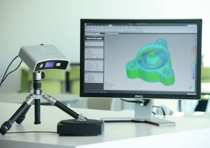
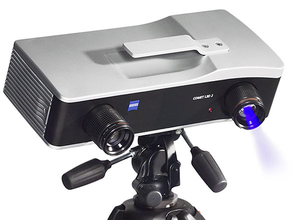
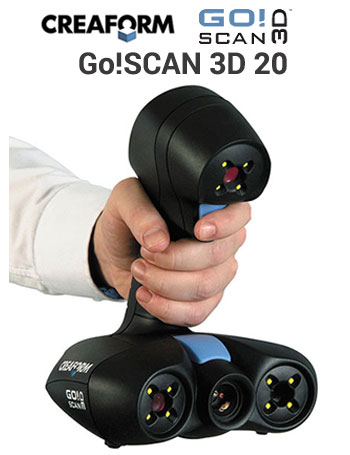
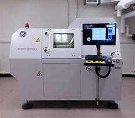

The Slater Lab uses a variety of solutions to capture 3D data from biological and paleontological specimens. Below are some of the pieces of equipment we have on hand in the lab or access to on campus

##Surface Scanners

<br/>
<div style= "float:left;position: relative; right: 20px;  top: 0px;">
```{r echo=FALSE, out.width="200px", fig.align='left'}

 

```
</div>

**The Capture Mini from 3D Systems** is a workhorse in our lab. This desktop, tripod mounted system works operates through Geomagic DesignX and can capture small - medium objects in relative high resolution. We have used the Capture mini on cranial, dental and post-cranial elements of taxa ranging from small rodents and birds to primates and carnivores. The system is very portable and can be easily transported to museums.

<br/><br/><br/>

<div style= "float:left;position: relative; right: 20px;  top: 0px;">
```{r echo=FALSE, out.width="200px", fig.align='left'}

 

```
</div>

**The Zeiss Comet L3D** is a blue LED light scanner. This system features interchangeable lenses, which means we can move between larger objects scanned at lower resolutions to very small objects scanned at very high resolutions (< 0.1 mm).

<br/><br/><br/><br/><br/>


<div style= "float:left;position: relative; right: 20px;  top: 0px;">
```{r echo=FALSE, out.width="200px", fig.align='left'}

 

```
</div>

We have two **Creaform Go!Scan handheld structured light scanners**. Both operate via VXElements software and have maximum resolutions of 0.1 and 0.5mm respectively. We use our GoScans for scanning larger structures, such as large mammalian skulls or limb bones.The GoScans work well for capturing large objects for research purposes but, because they can also capture texture (= color), they are also great for outreach. 

<br/><br/><br/><br/><br/><br/><br/>


##CT Scanning

<div style= "float:left;position: relative; right: 20px;  top: 0px;">
```{r echo=FALSE, out.width="200px", fig.align='left'}

 

```
</div>
Although we don't have our own CT scanner, lab members have access to **The UChicago PaleoCT lab**, which features a custom-built dual tube X-ray CT scanner from GE. It is equipped with a 180 kV nano CT tube and a high power 240 kV micro CT tube, allowing scanning of very small specimens with a resolution up to 0.4 um. The Slater lab has a **dedicated workstation running Dragonfly for processing CT data**.
</div>
