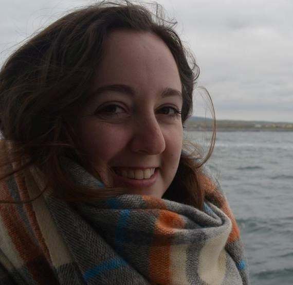
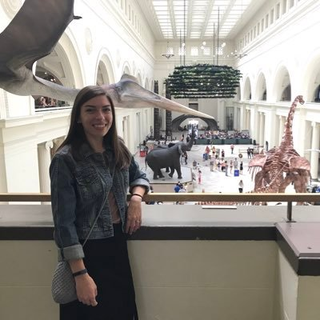

## The Boss
<br/>
<div style= "float:left;position: relative; right: 20px;  top: 0px;">
```{r echo=FALSE, out.width="200px", fig.align='left'}

knitr::include_graphics("gsloth.jpg") 

```
</div>

__Graham Slater__: I'm a macroevolutionary paleobiologist with interests in the tempo and mode of ecomorphological diversification across space and time. I use data from living and extinct species to address these questions, typically rooted in a phylogenetic framework. Although I'm interested in general questions about evolutionary pattern and process and my students work on diverse systems, most of my own work has focused on mammalian evolution, particularly the order Carnivora.  
<br/><br/><br/><br/>


# Current Graduate Students
<br/>


<div style= "float:left;position: relative; right: 20px; top: 0px;">
```{r echo=FALSE, out.width="150px", fig.align='left'}

 

```
</div>

__Melissa Wood__ is a fifth year PhD Candidate in the Department of the Geophysical Sciences. Melissa's dissertation research uses a combines vertebrate paleontology with stratigraphy to understand mammalian commmunity responses to climate and environmental change in the Eocene of North America. Melissa is coadvised with Susan Kidwell <br/><br/><br/><br/> 

<div style= "float:left;position: relative; right: 20px; top: 0px;">
```{r echo=FALSE, out.width="150px", fig.align='left'}

knitr::include_graphics("Menna.jpg") 

```
</div>

__Menna Jones__ is a second year PhD student in the Department of the Geophysical Sciences. Menna is interested in the use of statistical and mathematical approaches to study macroevolutionary pattern and processes. Her dissertation work is focusing on modeling the causes and consequences of ecomorphological evolution and microhabitat use in extant and extinct frogs. <br/> <br/><br/><br/>


<div style= "float:left;position: relative; right: 20px; top: 0px;">
```{r echo=FALSE, out.width="150px", fig.align='left'}

 

```
</div>

__Magdalen Mercado__ is a second year PhD student in the Department of the Committee on Evolutionary Biology. Mags is interested in the interplay of genetic and environmental factors in evolutionary change. Her dissertation work is focusing on the evolution of the amniote vertebral column using a variety of different data types and models. <br/> <br/><br/><br/><br/><br/>

<div style= "float:left;position: relative; right: 20px; top: 0px;">
```{r echo=FALSE, out.width="150px", fig.align='left'}

knitr::include_graphics("Henry.jpg") 

```
</div>

__Henry Fulghum__ is a second year PhD student in the Department of the Committee on Evolutionary Biology, coadvised with Zhe-Xi Luo. Henry is interested in the evolution of Mesozoic mammals, in particular the ecomorphological diversity of non-crown mammalian clades, and their potential ecological interactions. <br/> <br/><br/><br/><br/><br/>


# Lab Alums
<br/>
<div style= "float:left;position: relative; right: 20px;  top: 0px;">
```{r echo=FALSE, out.width="150px", fig.align='left'}

knitr::include_graphics("Tomo.jpg") 

```
</div>

[__Dr. C. Tomomi Parins-Fukuchi__](https://eeb.utoronto.ca/profile/parins-fukuchi-tomomi-c/) (T. C. Chamberlin Post-Doctoral Fellow 2019-2021): Tomo is currently Assistant Professor of Ecology and Evolution at University of Toronto, where he continues to pursue evolutionary questions relevant to biology and paleontology using diverse computational methods.<br/><br/><br/><br/><br/><br/><br/>


<div style= "float:left;position: relative; right: 20px;  top: 0px;">
```{r echo=FALSE, out.width="150px", fig.align='left'}

knitr::include_graphics("jon.jpg") 

```
</div>

[__Dr. Jonathan Nations__](https://www.floridamuseum.ufl.edu/people/jonathan-nations/) (NSF Post-Doctoral Fellow 2021-2024). Jon is currently Assistant Curator of Mammalogy at the Florida Museum of Natural History (University of Florida) where he continues to use field collections, observations, and museum specimens to examine the drivers of morphological variation, primarily using small mammals as model systems. Jon is increasingly interested in the use of complex statistical models, such as Bayesian multi-level models, and Artificial Intelligence approaches for addressing macroevolutionary and ecological questions.
<br/><br/><br/><br/>

<br/>

<div style= "float:left;position: relative; right: 20px; top: 0px;">
```{r echo=FALSE, out.width="150px", fig.align='left'}

 

```
</div>
[__Dr. Rossy Natale__](https://www.linkedin.com/in/rossy-natale-671b79103/) (PhD 2023 Integrative Biology): Rossy studied the evolution of functional and ecological morphological variation in charadriiform birds and the implications of that variation for community assembly and on potential responses to climate change. Rossy is now a postdoctoral associate at the Cornell Lab of Ornithology, where she is continuing to use spatial statistical approaches to study the implications of human activity for bird populations.  
<br/><br/><br/><br/>

<div style= "float:left;position: relative; right: 20px; top: 0px;">
```{r echo=FALSE, out.width="150px", fig.align='left'}

knitr::include_graphics("davidcerny.jpg") 

```
</div>


[__Dr. David Černý__](https://davidcerny.github.io/#hero) (PhD 2024 Geophysical Sciences): David is interested in how we infer phylogenetic trees of living and extinct organisms and develops new methods and pipelines to improve paleo-phylogenetic inference. David is currently doing postdoctoral research with Mike Alfaro at UCLA <br/><br/><br/><br/><br/>


<div style= "float:left;position: relative; right: 20px; top: -7px;">
```{r echo=FALSE, out.width="150px", fig.align='left'}

knitr::include_graphics("Anna_Wisniewski.jpeg") 

```
</div>
[__Dr Anna Wisniewski__](https://lsa.umich.edu/earth/people/post-docs-and-visitors/anna-wisniewski.html) (PhD 2024 Geophysical Sciences). Anna's dissertation work used phylogenetic and developmental models to understand macroevolutionary patterns in horses. Anna is now a Postdoctoral Fellow at the University of Michigan, where she is working with Luke Weaver on evolutionary and ecology trends in mammalian evolution across the PETM.

<br/><br/><br/><br/>
 
<div style= "float:left;position: relative; right: 20px; top: 0px;">
```{r echo=FALSE, out.width="150px", fig.align='left'}

 

```
</div>

[__Dr. Alexa Wimberly__](https://www.amnh.org/research/staff-directory/alexa-wimberly) (PhD 2024 Integrative Biology): Alexa's dissertation work focused on the evolution of locomotor behavior and morphology in tetrapods, particularly cursorial mammals. Alexa is currently a postdoctoral fellow in vertebrate paleontology at the American Museum of Natural History.
<br/><br/><br/><br/><br/>
 
