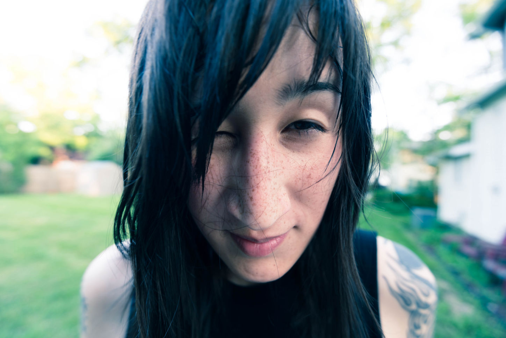
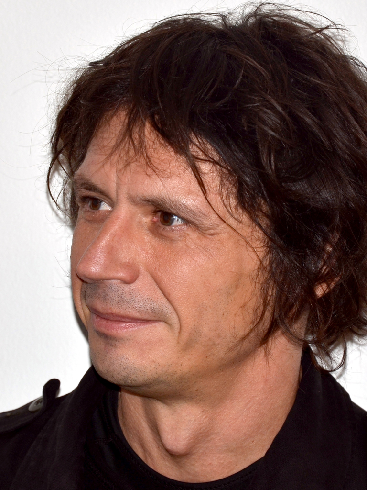

<div style= "float:left;position: relative; right: 20px;  top: 0px;">
```{r echo=FALSE, out.width="200px", fig.align='left'}

knitr::include_graphics("gsloth.jpg") 

```
</div>

__Graham Slater__: I'm a macroevolutionary paleobiologist with interests in the tempo and mode of ecomorphological diversification across space and time. I use data from living and extinct species to address these questions, typically rooted in a phylogenetic framework. Although I'm interested in general questions about evolutionary pattern and process and my students work on diverse systems, most of my own work has focused on mammalian evolution, particularly the order Carnivora.  
<br/><br/><br/>

# Post-Docs and Affiliates
<br/>
<div style= "float:left;position: relative; right: 20px;  top: 0px;">
```{r echo=FALSE, out.width="150px", fig.align='left'}

 

```
</div>

[__Caroline Parins-Fukuchi__](https://carolinetomo.github.io) is the T. C. Chamberlin post-doctoral fellow in the Department of the Geophysical Sciences at UofC. Caroline is a computational evolutionary biologist and anthropologist. Her work has addressed questions ranging from phylogenetic inference to indentifying  modules in complex morphological systems. In Chicago she's returning to her roots and joining us in some morphological evolution work. Caroline can code in more languages than most CIA agents speak. <br/>


# Graduate Students
<br/>

<div style= "float:left;position: relative; right: 20px; top: 0px;">
```{r echo=FALSE, out.width="150px", fig.align='left'}

knitr::include_graphics("rossy.jpg") 

```
</div>
[__Rossy Natale__](https://rossynnatale.github.io/personal_site/index.html) is a third year PhD candidate in the Integrative Biology program at UofC. She is interested in the evolution of functional and ecological morphological variation in charadriiform birds and the implications of that variation for community assembly and on potential responses to climate change. Rossy likes to run marathons through the woods in the middle of night.  
<br/><br/><br/><br/>

<div style= "float:left;position: relative; right: 20px; top: -7px;">
```{r echo=FALSE, out.width="150px", fig.align='left'}

knitr::include_graphics("Anna_Wisniewski.jpeg") 

```
</div>
[__Anna Wisniewski__](https://wisniewskianna.github.io) is a second year PhD student in the Department of the Geophysical Sciences at UofC. She is interested in mammalian phylogenetics and morphological evolution. Her dissertation work is using phylogenetic and developmental models to understand macroevolutionary patterns in horses. Anna is an accomplished competitive swimmer and professional comedian.

<br/><br/><br/><br/>
 
<div style= "float:left;position: relative; right: 20px; top: 0px;">
```{r echo=FALSE, out.width="150px", fig.align='left'}

knitr::include_graphics("alexa.jpg") 

```
</div>

__Alexa Lamprecht__ is a second year PhD student in the Integrative Biology program at UofC. She is interested in the evoluton of locomotor behavior and morphology in tetrapods, particularly cursorial mammals. When Alexa is not protecting the republic, she is can be found drawing memes on her office board.
<br/><br/><br/><br/><br/><br/>
 
<div style= "float:left;position: relative; right: 20px; top: 0px;">
```{r echo=FALSE, out.width="150px", fig.align='left'}

 

```
</div>


[__David Černý__](https://davidcerny.github.io/#hero) is a second year PhD student in the Department of the Geophysical Sciences at UofC. David is interested in how we infer phylogenetic trees of living and extinct organisms and is developing new tools to improve the paleo-phylogeneticists toolkit. Before getting into phylogenetics, David was a famous sculptor in his native Czech Republic.<br/> 
